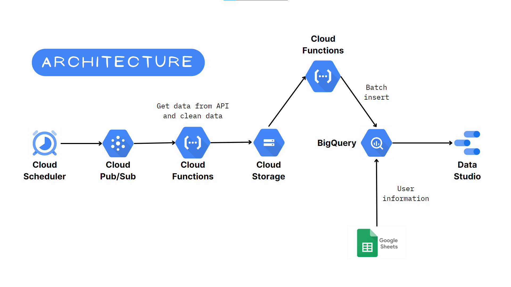
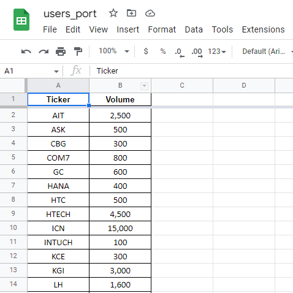
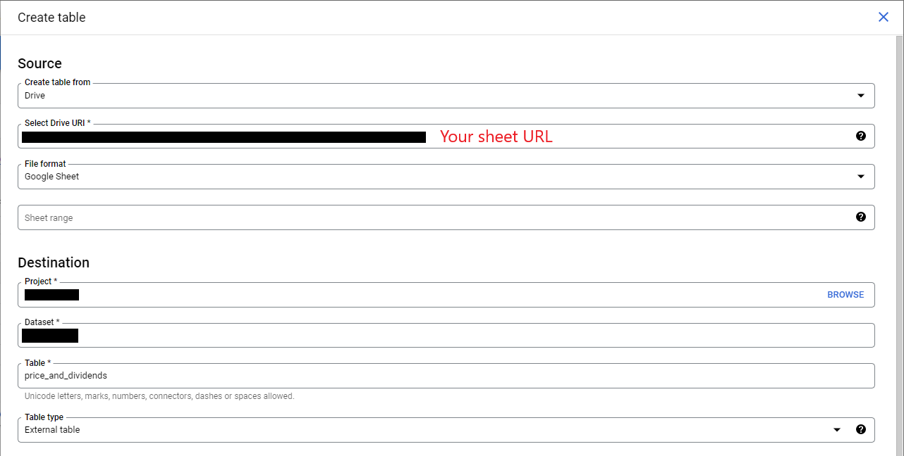
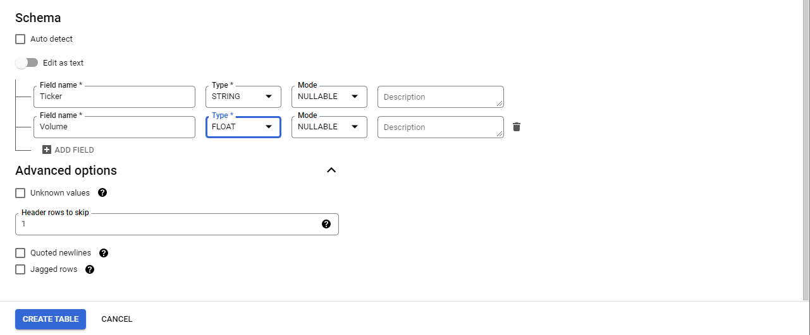
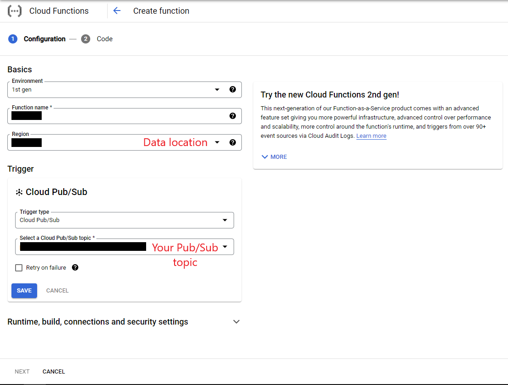

# Simple Dividend Report
Obtain all Thai ticker data via API, save it to Google Cloud Storage, and batch insert it into Google BigQuery using Google Cloud Function. (Require user to input some informations)

# Step to do
1. Create a new sheet in Google Sheets for the user's input.
2. Create BigQuery new dataset and tables with proper schema.
3. Create a new Cloud Storage bucket.
4. Create a new topic in Cloud Pub/Sub.
5. Deploy two Cloud Functions.
6. Create new job in Cloud Scheduler.
7. Test the system
8. Use scheduled queries in BigQuery to make the appropriate table.
9. Create data visualizations with Data Studio.

### More detail
1. Create a new sheet in Google Sheets for the user's input. In this project, we require the user to input port information, such as ticker and ticker volume, that they have in port.

 

2. Create BigQuery new dataset and tables with proper schema. You need to order the table schemas correctly and remember your data location setting. You need to set other Google platforms to the same data location.

Table schema  
| Field name | Type   | Mode     |
| :--------- | :----- | :------- |
| Ticker     | STRING | NULLABLE |
| Date       | DATE   | NULLABLE |
| Price      | FLOAT  | NULLABLE |
| Dividend   | FLOAT  | NULLABLE |

Make a table that is synced with the sheet we created. The setting shown below

3. Create a new Cloud Storage bucket. Make sure the bucket has the same data location as the dataset in BigQuery.

4. Create a new topic in Cloud Pub/Sub. Rename the topic ID to reflect the task to be completed.

5. Deploy two Cloud Functions. First, get data from API, clean the data, and upload it to Cloud Storage. Last, upload data to BigQuery. These two functions are in SimpleDividendReport/CloudFunctions. The setting use in this project show below.

6. Create new job in Cloud Scheduler. Set it to trigger whatever you want and set target to your new Pub/Sub topic.

7. Test the system. If everything works correctly, it'll have a new table at BigQuery. (price_and_dividend)

8. Use scheduled queries in BigQuery to make the appropriate table. Reccommend to create new query and save as view, because you can edit your code and inspect table as the same time. Order the scheduled query as follows.
- dividend_per_year **and** last_price
- dividend_report
- users_process_dividend_report
- users_dividend_report

9. Create data visualizations with Data Studio.

# Things can be improve
- Store sets of user information if user has more than one set of information.
- View history prices.
- Optimize merging code in BigQuery. (Too many steps)
- Create chart represent total value and total dividend in port.   